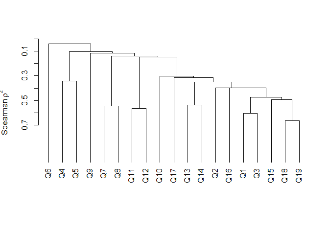
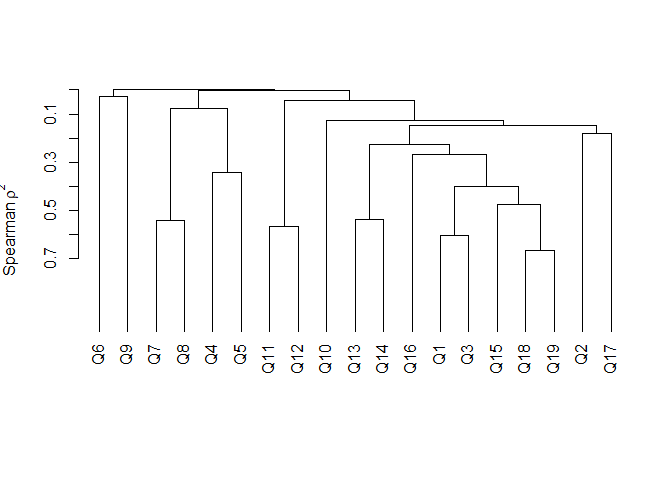
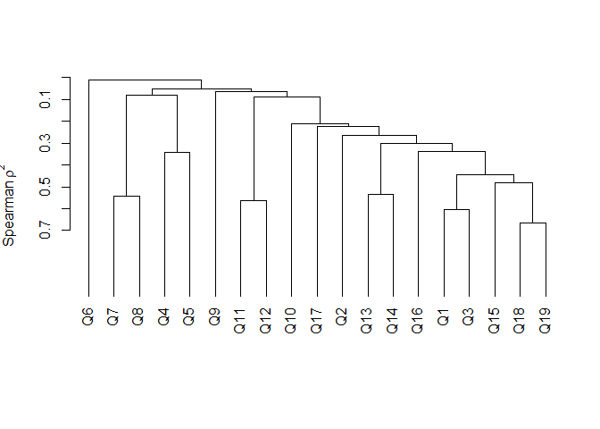
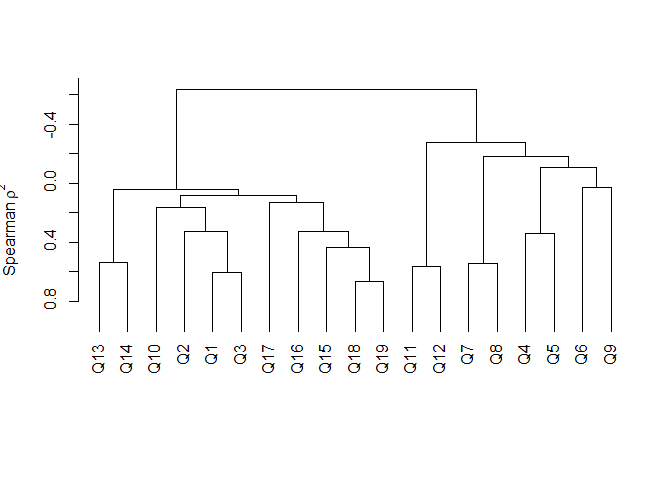
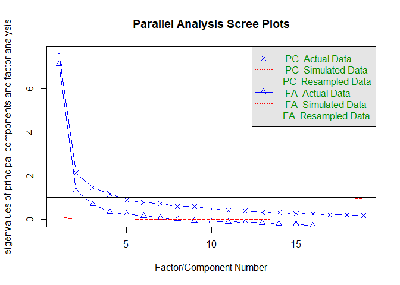
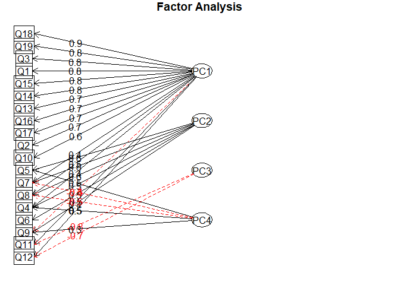

# Hierarchical Clustering and Factor Analysis for Music Survey Data
Andrew Kinsman  
June 3, 2016  


In this exercise the objective is to identify which variables are similar to one another. Which questions receive similar answers from users?

```r
users <- read.csv("users.csv", na.strings = "")
str(users)
```

```
## 'data.frame':	48645 obs. of  27 variables:
##  $ RESPID   : int  36927 3566 20054 41749 23108 42754 4596 40555 8673 5195 ...
##  $ GENDER   : Factor w/ 2 levels "Female","Male": 1 1 1 1 1 2 1 1 1 2 ...
##  $ AGE      : int  60 36 52 40 16 20 58 50 45 41 ...
##  $ WORKING  : Factor w/ 13 levels "Employed 30+ hours a week",..: 7 4 1 2 5 13 10 1 NA 1 ...
##  $ REGION   : Factor w/ 6 levels "Centre","Midlands",..: 6 6 2 6 3 2 3 2 1 6 ...
##  $ MUSIC    : Factor w/ 6 levels "I like music but it does not feature heavily in my life",..: 3 3 1 6 6 6 1 3 1 3 ...
##  $ LIST_OWN : Factor w/ 42 levels "0","0 Hours",..: 4 4 4 23 28 32 4 4 NA 36 ...
##  $ LIST_BACK: Factor w/ 41 levels "0","0 Hours",..: NA 4 40 27 33 NA 22 31 26 4 ...
##  $ Q1       : num  49 55 11 81 76 74 31 50 9 10 ...
##  $ Q2       : num  50 55 50 80 79 100 31 32 46 17 ...
##  $ Q3       : num  49 62 9 88 78 100 37 51 11 17 ...
##  $ Q4       : num  50 9 8 88 73 54 78 68 10 8 ...
##  $ Q5       : num  32 9 45 31 71 54 58 69 10 7 ...
##  $ Q6       : num  33 9 10 31 68 18 11 31 52 8 ...
##  $ Q7       : num  32 10 30 51 73 53 82 33 70 7 ...
##  $ Q8       : num  0 11 29 30 67 27 13 31 10 8 ...
##  $ Q9       : num  74 55 8 8 31 5 70 54 51 28 ...
##  $ Q10      : num  50 12 50 76 56 100 52 12 50 48 ...
##  $ Q11      : num  50 65 94 74 13 72 71 100 72 69 ...
##  $ Q12      : num  71 65 51 64 82 73 50 67 49 81 ...
##  $ Q13      : num  52 80 74 73 79 100 34 64 13 7 ...
##  $ Q14      : num  71 79 66 85 68 100 25 71 11 62 ...
##  $ Q15      : num  9 51 27 61 71 75 10 7 13 12 ...
##  $ Q16      : num  7 31 46 77 NA 74 14 27 8 10 ...
##  $ Q17      : num  72 68 73 76 86 76 49 72 48 6 ...
##  $ Q18      : num  49 54 8 78 80 34 29 52 NA 8 ...
##  $ Q19      : num  26 33 31 88 32 73 24 31 NA 7 ...
```
Here we shall start with a cluster analysis. There are various hierarchical clustering methods that could 
be employed, each of which takes a different approach to defining the distances between clusters. Here 
we compare four different methods.

```r
library(Hmisc)
```

```
## Loading required package: lattice
```

```
## Loading required package: survival
```

```
## Loading required package: Formula
```

```
## Loading required package: ggplot2
```

```
## 
## Attaching package: 'Hmisc'
```

```
## The following objects are masked from 'package:base':
## 
##     format.pval, round.POSIXt, trunc.POSIXt, units
```

```r
ques.single <- varclus(data.matrix(users[,-c(1:8)]),method="single")
plot(ques.single, hang=-1) 
```

<!-- -->

The first method (above) is single linkage clustering. This defines the distance between two clusters as the shortest distance between a point in one cluster and a point in another cluster. Here Q6 resides in a cluster all on its own, which seems sub-optimal given that we are trying to identify homogeneous groups of questions.


```r
ques.complete <- varclus(data.matrix(users[,-c(1:8)]),method="complete")
plot(ques.complete, hang=-1) 
```

<!-- -->

Complete linkage clustering defines the distance between two clusters as the longest distance between a point in one cluster and a point in another cluster. Here we see that Q6 and Q9 are each in a cluster all by themselves.


```r
ques.average <- varclus(data.matrix(users[,-c(1:8)]),method="average")
plot(ques.average, hang=-1) 
```

<!-- -->

Thirdly, average linkage clustering defines the distance between two clusters as the average distance between each point in one cluster and each point in another cluster. Again we see Q6 in a cluster all by itself.


```r
ques.ward2 <- varclus(data.matrix(users[,-c(1:8)]),method="ward.D2")     
plot(ques.ward2, hang=-1) 
```

<!-- -->

Finally, Ward clustering defines the distance between two clusters as the ANOVA sum of squares between the two clusters added up over all the variables. Here we see a more even spread between the clusters. It appears that the Ward method is probably the most suitable of the four methods for this particular dataset.

In order to interpret the make-up of each cluster, we should add the questions as labels so that they  can be viewed in relation to one another.


```r
label(users$Q1) <- "I enjoy actively searching for and discovering music that I have never heard before"
label(users$Q2) <- "I find it easy to find new music" 
label(users$Q3) <- "I am constantly interested in and looking for more music"
label(users$Q4) <- "I would like to buy new music but I don't know what to buy"
label(users$Q5) <- "I used to know where to find music"
label(users$Q6) <- "I am not willing to pay for music"
label(users$Q7) <- "I enjoy music primarily from going out to dance"
label(users$Q8) <- "Music for me is all about nightlife and going out"
label(users$Q9) <- "I am out of touch with new music"
label(users$Q10) <- "My music collection is a source of pride"
label(users$Q11) <- "Pop music is fun"
label(users$Q12) <- "Pop music helps me to escape"
label(users$Q13) <- "I want a multi media experience at my fingertips wherever I go"
label(users$Q14) <- "I love technology"
label(users$Q15) <- "People often ask my advice on music - what to listen to"
label(users$Q16) <- "I would be willing to pay for the opportunity to buy new music pre-release"
label(users$Q17) <- "I find seeing a new artist / band on TV a useful way of discovering new music"
label(users$Q18) <- "I like to be at the cutting edge of new music"
label(users$Q19) <- "I like to know about music before other people"
```
Let us start by analysing five clusters produced by the Ward method:

```r
ques.clusters.w2 <- cutree(ques.ward2$hclust,h=1-(-0.1))
ques.clusters.w2
```

```
##  Q1  Q2  Q3  Q4  Q5  Q6  Q7  Q8  Q9 Q10 Q11 Q12 Q13 Q14 Q15 Q16 Q17 Q18 
##   1   1   1   2   2   3   4   4   3   1   5   5   1   1   1   1   1   1 
## Q19 
##   1
```
How can we interpret these five clusters?

```r
unname(label(users[9:27])[which(ques.clusters.w2==1)])
```

```
##  [1] "I enjoy actively searching for and discovering music that I have never heard before"
##  [2] "I find it easy to find new music"                                                   
##  [3] "I am constantly interested in and looking for more music"                           
##  [4] "My music collection is a source of pride"                                           
##  [5] "I want a multi media experience at my fingertips wherever I go"                     
##  [6] "I love technology"                                                                  
##  [7] "People often ask my advice on music - what to listen to"                            
##  [8] "I would be willing to pay for the opportunity to buy new music pre-release"         
##  [9] "I find seeing a new artist / band on TV a useful way of discovering new music"      
## [10] "I like to be at the cutting edge of new music"                                      
## [11] "I like to know about music before other people"
```
The first cluster contains serious music aficionados who are at the cutting edge and like to own the latest gadgets.

```r
unname(label(users[9:27])[which(ques.clusters.w2==2)]) 
```

```
## [1] "I would like to buy new music but I don't know what to buy"
## [2] "I used to know where to find music"
```
The second group appears to be most likely somewhat older music lovers who would like to discover new music but haven't kept up with current trends. 

```r
unname(label(users[9:27])[which(ques.clusters.w2==3)]) 
```

```
## [1] "I am not willing to pay for music" "I am out of touch with new music"
```
The third group is a non-music buying group that doesn't keep up with new trends, and appears to overlap somewhat with cluster 2. 

```r
unname(label(users[9:27])[which(ques.clusters.w2==4)]) 
```

```
## [1] "I enjoy music primarily from going out to dance"  
## [2] "Music for me is all about nightlife and going out"
```
The fourth group enjoys music primarily when they go out at night.

```r
unname(label(users[9:27])[which(ques.clusters.w2==5)]) 
```

```
## [1] "Pop music is fun"             "Pop music helps me to escape"
```
The final cluster are people who simply see pop music as a means of fun and escape.

Given that clusters 2 and 3 seem to share some characteristics, we should try four clusters instead:

```r
ques.clusters.w2b <- cutree(ques.ward2$hclust,h=1-(-0.15))
ques.clusters.w2b
```

```
##  Q1  Q2  Q3  Q4  Q5  Q6  Q7  Q8  Q9 Q10 Q11 Q12 Q13 Q14 Q15 Q16 Q17 Q18 
##   1   1   1   2   2   2   3   3   2   1   4   4   1   1   1   1   1   1 
## Q19 
##   1
```
Cluster 1 remains unchanged and clusters 3 and 4 are also unchanged (albeit now renamed from clusters 4 and 5 in the previous analysis). However, clusters 2 and 3 from the previous analysis have now been merged to form one cluster, cluster 2.

```r
unname(label(users[9:27])[which(ques.clusters.w2b==1)]) 
```

```
##  [1] "I enjoy actively searching for and discovering music that I have never heard before"
##  [2] "I find it easy to find new music"                                                   
##  [3] "I am constantly interested in and looking for more music"                           
##  [4] "My music collection is a source of pride"                                           
##  [5] "I want a multi media experience at my fingertips wherever I go"                     
##  [6] "I love technology"                                                                  
##  [7] "People often ask my advice on music - what to listen to"                            
##  [8] "I would be willing to pay for the opportunity to buy new music pre-release"         
##  [9] "I find seeing a new artist / band on TV a useful way of discovering new music"      
## [10] "I like to be at the cutting edge of new music"                                      
## [11] "I like to know about music before other people"
```
The interpretation of this cluster is obvously the same as cluster 1 above - serious music aficionados who are at the cutting edge and like to own the latest gadgets.

```r
unname(label(users[9:27])[which(ques.clusters.w2b==2)])
```

```
## [1] "I would like to buy new music but I don't know what to buy"
## [2] "I used to know where to find music"                        
## [3] "I am not willing to pay for music"                         
## [4] "I am out of touch with new music"
```
This cluster contains people who are out of the loop nowadays with regard current trends and may or may not be interested in purchasing music.

```r
unname(label(users[9:27])[which(ques.clusters.w2b==3)]) 
```

```
## [1] "I enjoy music primarily from going out to dance"  
## [2] "Music for me is all about nightlife and going out"
```
The interpretation of this cluster is the same as cluster 4 above - these are people who enjoy music primarily when they go out at night.

```r
unname(label(users[9:27])[which(ques.clusters.w2b==4)]) 
```

```
## [1] "Pop music is fun"             "Pop music helps me to escape"
```
The interpretation of this cluster is the same as cluster 5 above - people who simply see pop music as means of fun and escape.

It appears that using the Ward method with four clusters results in four quite distinctive groups. Broadly these are: the serious music buffs, those who have lost touch with current trends, the nightlife music fans and the pop music escapists.

These four clusters could potentially be used to classify users into one of four groups, thereby reducing the dimensionality of the 19 questions down to a single categorical variable (with four levels).

Instead of clustering, factor analysis could also be used to find groupings of similar questions:

```r
library(psych)
```

```
## 
## Attaching package: 'psych'
```

```
## The following object is masked from 'package:Hmisc':
## 
##     describe
```

```
## The following objects are masked from 'package:ggplot2':
## 
##     %+%, alpha
```

```r
fa.parallel(users[, 9:27], n.iter=100)
```

<!-- -->

```
## Parallel analysis suggests that the number of factors =  8  and the number of components =  4
```

```r
users.prin <- principal(users[,9:27], nfactors=4, rotate="none")
users.prin
```

```
## Principal Components Analysis
## Call: principal(r = users[, 9:27], nfactors = 4, rotate = "none")
## Standardized loadings (pattern matrix) based upon correlation matrix
##       PC1   PC2   PC3   PC4   h2   u2 com
## Q1   0.80 -0.23  0.20  0.06 0.73 0.27 1.3
## Q2   0.68 -0.28 -0.01 -0.10 0.55 0.45 1.4
## Q3   0.82 -0.23  0.13  0.06 0.75 0.25 1.2
## Q4   0.40  0.52  0.20  0.49 0.71 0.29 3.2
## Q5   0.25  0.64  0.27  0.45 0.75 0.25 2.6
## Q6  -0.05  0.48  0.21 -0.27 0.35 0.65 2.0
## Q7   0.43  0.60 -0.02 -0.48 0.77 0.23 2.8
## Q8   0.46  0.58  0.06 -0.48 0.77 0.23 2.9
## Q9  -0.37  0.41  0.16  0.30 0.42 0.58 3.2
## Q10  0.62 -0.23  0.05  0.17 0.47 0.53 1.4
## Q11  0.46  0.24 -0.76  0.10 0.86 0.14 1.9
## Q12  0.52  0.24 -0.71  0.13 0.85 0.15 2.2
## Q13  0.75  0.01 -0.05 -0.03 0.56 0.44 1.0
## Q14  0.76 -0.09 -0.04  0.00 0.59 0.41 1.0
## Q15  0.80 -0.10  0.18 -0.05 0.68 0.32 1.1
## Q16  0.74  0.04  0.11  0.01 0.56 0.44 1.1
## Q17  0.68 -0.02 -0.15  0.16 0.51 0.49 1.2
## Q18  0.86 -0.06  0.12 -0.06 0.76 0.24 1.1
## Q19  0.84 -0.08  0.19 -0.04 0.75 0.25 1.1
## 
##                        PC1  PC2  PC3  PC4
## SS loadings           7.62 2.14 1.45 1.18
## Proportion Var        0.40 0.11 0.08 0.06
## Cumulative Var        0.40 0.51 0.59 0.65
## Proportion Explained  0.61 0.17 0.12 0.09
## Cumulative Proportion 0.61 0.79 0.91 1.00
## 
## Mean item complexity =  1.8
## Test of the hypothesis that 4 components are sufficient.
## 
## The root mean square of the residuals (RMSR) is  0.05 
##  with the empirical chi square  45600.6  with prob <  0 
## 
## Fit based upon off diagonal values = 0.98
```

```r
fa.diagram(users.prin, simple=F)
```

<!-- -->

If we examine the loadings, the first principal component primarily contains the same questions as 
cluster 1 above, above (i.e. Q1: Q3, Q10 and Q13:Q17), PC2 is basically Q4 to Q9 (which correspond to clusters 2 and 3 above), while PC3 is Q11 and 12, i.e. cluster 4 above. The fourth principal component is mainly a contrast between clusters 2 and 3 above.

This factor analysis therefore more or less confirms the clustering results from above.

# Summary

It appears that the music users in this dataset can be broken down into four fairly distinct clusters, based solely on their responses to the 19 questions that they were asked. The first group is the serious music fan, the second is people who have not kept up with current trends, the third is those who primarily enjoy music when they are out in the evening and the final group is pop fans who just see their music as a piece of escapism.

Clearly group 1 would be the one to target for anyone in the business of selling records or hi-fi equipment.

